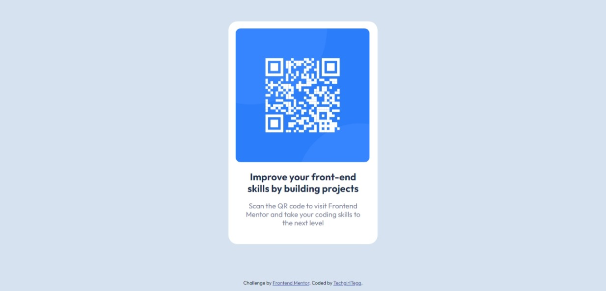

# Frontend Mentor - QR code component solution

Hi there!, TechgirlTega here, and I am on the learning path with Frontend Mentor.

This is a solution to the [QR code component challenge on Frontend Mentor](https://www.frontendmentor.io/challenges/qr-code-component-iux_sIO_H). Frontend Mentor challenges help you improve your coding skills by building realistic projects. 

## Table of contents

- [Overview](#overview)
  - [Screenshot](#screenshot)
  - [Links](#links)
  - [My process](#my-process)
  - [Built with](#built-with)
  - [What I learned](#what-i-learned)
  - [Author](#author)

## Overview

### Screenshot

### Links
- Fonts (https://fonts.google.com/specimen/Outfit)

## My process

### Built with

- Semantic HTML5 markup
- CSS custom properties

### What I learned

On this Project, the HTML was easy to code but while working on the CSS, I had to go back to create a div for the QR Code image. Doing that made it easy for me to edit and position the image in the right place.

It's a Great start for me and i can't wait to take up the next project.

## Author
- Frontend Mentor - [@Tegaetina](https://www.frontendmentor.io/profile/Tegaetina)
- Instagram - [@Techgirltega](https://www.instagram.com/techgirltega)